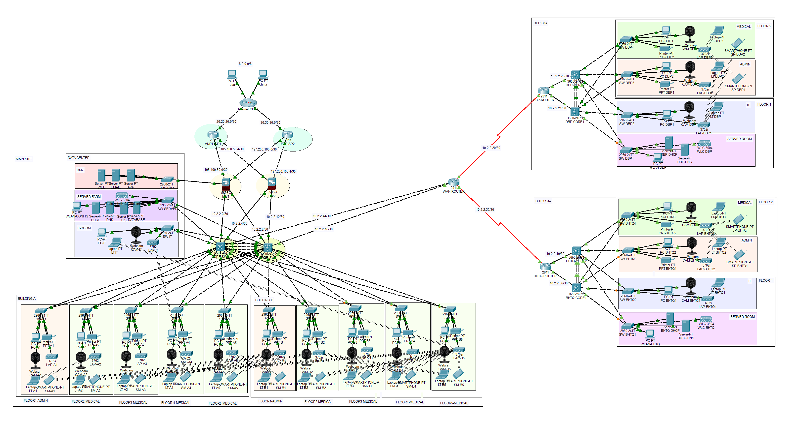

# Cisco Packet Tracer simulation of a hospital network

This is a simulation for hospital network in Cisco Packet Trace

* Cisco Packet Tracer simulation file: `HOSPITAL.pkt`
* Step-by-step tutorial: `hospital-step-1.md`, `hospital-step-2.md`, `hospital-step-3.md`.

How to run: 

1. Download `HOSPITAL.pkt` and open in Cisco Packet Trace
2. Wait for about 1-2 minutes for the network to be fully loaded and configured.
3. Test connectivity:
    * Go to a device (PC/laptop/smart phone) and open Desktop -> Command Prompt
    * Try to ping another device in the network, such as same VLAN, different VLAN, different sites, DMZ, outside (Internet, represented by the two PC in USA and China).
    * Note: The smart phones were configured to connect to Guest WIFI, and therefore can only access the Internet. They cannot ping other devices inside the LAN.

